# 🛍️ Shopee E-Commerce – Manual Testing Portfolio Project
### End-to-End Test Case Design, Execution & Defect Management (Order & Checkout Journey)

<p align="left">
  
  
  
  
  
  
</p>

---

## 📌 1. Project Overview

This repository showcases an industry-standard **Manual Software Testing Portfolio** focusing on the critical **Order & Checkout Journey** of the Shopee e-commerce platform. 

The project demonstrates complete end-to-end coverage across the **Software Testing Life Cycle (STLC)**: from **Requirement Analysis** and **Test Planning (IEEE 829)** to **Black-Box Test Case Design**, **Execution Simulation**, **Jira-style Defect Logging**, and final **Test Summary Reporting**.

> 💡 **Tóm tắt dự án:**  
> Dự án kiểm thử quy trình Đặt hàng & Thanh toán (Checkout) Shopee, bao gồm đầy đủ 79 Test Cases chi tiết, kế hoạch kiểm thử (Test Plan chuẩn IEEE 829), Ma trận truy vết yêu cầu (RTM), Kỹ thuật thiết kế kiểm thử hộp đen (EP, BVA, Decision Table), Báo cáo lỗi (Defect Log & Bug Reports thực tế) và Báo cáo tổng kết kiểm thử (Test Execution Summary Report).

---

## 📑 2. Table of Contents

- [1. Project Overview](#-1-project-overview)
- [2. System Flow & Testing Scope](#-3-system-flow--testing-scope)
- [3. Repository Architecture](#-4-repository-architecture)
- [4. Test Design Techniques Applied](#-5-test-design-techniques-applied)
- [5. Test Execution Metrics Dashboard](#-6-test-execution-metrics-dashboard)
- [6. Defect Management & Sample Bug Reports](#-7-defect-management--sample-bug-reports)
- [7. Key Deliverables & Quick Access](#-8-key-deliverables--quick-access)
- [8. Candidate Profile & Contact](#-9-candidate-profile--contact)

---

## 🔄 3. System Flow & Testing Scope

The test suite covers every customer checkpoint from adding items to cart until payment authorization and order confirmation:

```mermaid
flowchart LR
    Cart["🛒 Cart / Buy Now\n(TC_01 - TC_02)"] --> Addr["📍 Address & Customs ID\n(TC_05 - TC_10)"]
    Addr --> Ship["🚚 Shipping Channel\n(TC_24 - TC_30)"]
    Ship --> Promo["🏷️ Vouchers & Coins\n(TC_31 - TC_43)"]
    Promo --> Pay["💳 Payment Method\n(TC_44 - TC_52)"]
    Pay --> Calc["💰 Grand Total Calculation\n(TC_53 - TC_61)"]
    Calc --> Order["✅ Order Placement\n(TC_62 - TC_63)"]
    Order --> Tax["📄 Multi-Shop & VAT\n(TC_64 - TC_79)"]
```



### In-Scope Functional Modules:
1. **Cart & Direct Checkout**: Add to cart, quantity increments, direct "Buy Now" redirection.
2. **Checkout UI Consistency**: Responsive alignment, typography, interactive toggles.
3. **Shipping Information & Customs Compliance**: Default address display, inline address editor, 12-digit Citizen ID (CCCD) validation for cross-border items.
4. **Shop & Product Verification**: Seller badges (Mall, Preferred), SKU variations, real-time item availability.
5. **Logistics & Delivery Channels**: Standard, Express, Economy options; dynamic shipping fee updates; delivery date estimation.
6. **Promotions & Voucher Engine**: Percentage and flat-rate shop vouchers, platform coupons, free shipping subsidies, minimum spend boundaries, voucher stacking rules, Shopee Coins (50% cap).
7. **Payment Gateways**: Cash on Delivery (COD rules $\le 5\text{M VND}$), ShopeePay wallet balance, SPayLater installments (1X, 3X, 6X, 12X), Credit/Debit cards.
8. **Financial Summary**: Mathematical precision: $\text{Total} = \text{Subtotal} + \text{Shipping} - \text{Vouchers} - \text{Coins} + \text{Insurance}$.
9. **Multi-Seller Order Splitting & E-Invoicing**: Splitting orders across multiple shops, independent shop vouchers, personal & company VAT tax invoice forms.

---

## 📂 4. Repository Architecture

```text
shopee-order-manual-testing-fresher-portfolio/
│
├── README.md                           # Master Portfolio Documentation
├── .gitignore                          # Standard gitignore (Office temps, OS rác, Python)
├── GITHUB_UPLOAD_GUIDE.md              # Hướng dẫn upload GitHub & Mẫu viết vào CV
│
├── docs/                               # Formal QA Documentation (ISTQB / IEEE 829)
│   ├── 01_Test_Plan.md                 # Test Plan (Scope, Objectives, Criteria, Risks)
│   ├── 02_Test_Strategy_Techniques.md  # Detailed Black-box Techniques (EP, BVA, Decision Table)
│   ├── 03_RTM_Traceability_Matrix.md   # Requirements Traceability Matrix (100% Coverage)
│   └── 04_Order_Flowchart_Mindmap.md   # Visual Mermaid Flowcharts & Mindmaps
│
├── test-scenarios/                     # High-level Scenario Specifications
│   └── Test_Scenarios.md               # 10 Main Scenarios mapped to individual TCs
│
├── test-cases/                         # Test Cases in Multiple Formats
│   ├── Shopee_Order_Testcase.xlsx      # Professional Styled Excel (Color badges, Priority, Status)
│   ├── Shopee_Order_Test_Cases.csv     # Plain CSV for fast Git diff & preview
│   └── Test_Cases_Specification.md     # 100% Renderable Markdown Table (Direct Web Viewing)
│
├── bug-reports/                        # Defect Tracking & Real Bug Reports
│   ├── Bug_Report_Template.md          # Jira / Azure DevOps standard defect template
│   ├── Defect_Log.md                   # Defect tracking matrix and severity breakdown
│   ├── BUG_001.md                      # Major Bug: Missing inline validation for Citizen ID
│   ├── BUG_002.md                      # Major Bug: Voucher minimum-spend displays raw placeholder
│   └── BUG_003.md                      # Minor Bug: SPayLater tenure unclickable on landscape view
│
└── test-reports/                       # Formal Test Summary & Evaluation
    └── Test_Execution_Summary_Report.md# IEEE 829 Test Summary Report (Pass Rate, Sign-off)
```

---

## 🧪 5. Test Design Techniques Applied

This project applies formal **ISTQB-aligned Black-Box Test Design Techniques**:

| Technique | Application in this Project | Example Test Case |
|---|---|:---:|
| **Equivalence Partitioning (EP)** | Segmenting valid/invalid Citizen ID formats (12 digits vs. alphanumeric or invalid lengths) and coupon codes. | [`TC_09`](test-cases/Test_Cases_Specification.md#tc_09), [`TC_10`](test-cases/Test_Cases_Specification.md#tc_10) |
| **Boundary Value Analysis (BVA)** | Testing min spend voucher thresholds (249,999 VND vs. 250,000 VND), max discount caps (50,000 VND limit), and Shopee Coin 50% cap. | [`TC_34`](test-cases/Test_Cases_Specification.md#tc_34), [`TC_36`](test-cases/Test_Cases_Specification.md#tc_36) |
| **Decision Table Testing** | Combinatorial matrix for multi-voucher stacking: Platform Voucher + Shop Voucher + Free Shipping subsidy. | [`TC_56`](test-cases/Test_Cases_Specification.md#tc_56) |
| **State Transition Testing** | Order lifecycle transitions: `Draft Cart` $\rightarrow$ `Checkout Pending` $\rightarrow$ `Payment Authorization` $\rightarrow$ `Order Confirmed`. | [`TC_01`](test-cases/Test_Cases_Specification.md#tc_01), [`TC_62`](test-cases/Test_Cases_Specification.md#tc_62) |
| **Error Guessing & Exploratory** | Double-clicking "Place Order" button, payment gateway timeout handling, device rotation on checkout forms. | [`TC_60`](test-cases/Test_Cases_Specification.md#tc_60), [`TC_49`](test-cases/Test_Cases_Specification.md#tc_49) |

*Full details and analysis can be found in [`docs/02_Test_Strategy_Techniques.md`](docs/02_Test_Strategy_Techniques.md).*

---

## 📊 6. Test Execution Metrics Dashboard

### Execution Overview:
- **Total Test Cases**: **79**
- **Executed**: **79 (100%)**
- **Passed**: **75 (94.94%)** ✅
- **Failed**: **3 (3.80%)** ❌
- **Blocked**: **1 (1.26%)** ⚠️

```text
Status Breakdown:
Passed:  ███████████████████████████████████████████████ 75 (94.94%)
Failed:  ██ 3 (3.80%)
Blocked: █ 1 (1.26%)
```

### Module Breakdown:

| Module | Total TCs | High (P1) | Med (P2) | Low (P3) | Passed | Failed | Blocked | Pass Rate |
|---|:---:|:---:|:---:|:---:|:---:|:---:|:---:|:---:|
| **Cart** | 2 | 2 | 0 | 0 | 2 | 0 | 0 | **100%** |
| **Checkout UI Overview** | 2 | 0 | 0 | 2 | 2 | 0 | 0 | **100%** |
| **Shipping Address & ID** | 6 | 3 | 3 | 0 | 5 | 1 | 0 | **83.3%** |
| **Shop & Product Details** | 13 | 2 | 10 | 1 | 13 | 0 | 0 | **100%** |
| **Shipping Methods** | 7 | 2 | 5 | 0 | 7 | 0 | 0 | **100%** |
| **Voucher & Promotions** | 13 | 4 | 9 | 0 | 12 | 1 | 0 | **92.3%** |
| **Payment Details** | 9 | 4 | 5 | 0 | 8 | 1 | 0 | **88.9%** |
| **Order Details & Calculation** | 9 | 6 | 3 | 0 | 9 | 0 | 0 | **100%** |
| **Payment Results** | 2 | 2 | 0 | 0 | 1 | 0 | 1 | **50.0%** |
| **Multi-Shop & E-Invoicing** | 16 | 2 | 13 | 1 | 16 | 0 | 0 | **100%** |
| **TOTAL** | **79** | **27** | **48** | **4** | **75** | **3** | **1** | **94.94%** |

👉 *Recruiters can view all 79 test cases with steps and expected results directly in [Test_Cases_Specification.md](test-cases/Test_Cases_Specification.md).*

---

## 🐛 7. Defect Management & Sample Bug Reports

Unlike conventional academic portfolios that assume 100% pass rates, this repository features **3 realistic, reproducible defects** logged with professional Jira-grade details:

| Bug ID | Title | Severity | Priority | Status | Linked TC |
|:---:|---|:---:|:---:|:---:|:---:|
| [**BUG_001**](bug-reports/BUG_001.md) | Inline validation error missing when submitting empty or invalid Citizen ID for cross-border clearance | **Major** | **High (P1)** | `Open` | `TC_10` |
| [**BUG_002**](bug-reports/BUG_002.md) | Voucher minimum-spend error tooltip renders unformatted raw string placeholder `{0} VND` | **Major** | **Medium (P2)** | `In Progress` | `TC_34` |
| [**BUG_003**](bug-reports/BUG_003.md) | SPayLater installment tenure dropdown becomes unclickable upon rotating mobile screen to landscape | **Minor** | **Low (P3)** | `Open` | `TC_49` |

*View complete defect log in [`bug-reports/Defect_Log.md`](bug-reports/Defect_Log.md).*

---

## 🚀 8. Key Deliverables & Quick Access

| Document | File Link | Description |
|---|---|---|
| **Test Plan** | [`01_Test_Plan.md`](docs/01_Test_Plan.md) | Full IEEE 829 Test Plan (Objectives, Strategy, Criteria, Risks) |
| **Test Strategy** | [`02_Test_Strategy_Techniques.md`](docs/02_Test_Strategy_Techniques.md) | Deep-dive explanation of EP, BVA, Decision Tables, Error Guessing |
| **Traceability Matrix** | [`03_RTM_Traceability_Matrix.md`](docs/03_RTM_Traceability_Matrix.md) | Forward and backward mapping between Requirements and TCs |
| **Order Flowcharts** | [`04_Order_Flowchart_Mindmap.md`](docs/04_Order_Flowchart_Mindmap.md) | Visual Mermaid diagrams of the Shopee checkout workflow |
| **Test Scenarios** | [`Test_Scenarios.md`](test-scenarios/Test_Scenarios.md) | High-level scenario breakdowns mapped to individual TCs |
| **Test Case Markdown** | [`Test_Cases_Specification.md`](test-cases/Test_Cases_Specification.md) | **Direct web viewing of all 79 test cases** (No download needed!) |
| **Styled Excel Sheet** | [`Shopee_Order_Testcase.xlsx`](test-cases/Shopee_Order_Testcase.xlsx) | Professional formatted Excel with priority and status styling |
| **Defect Reports** | [`Defect_Log.md`](bug-reports/Defect_Log.md) | Complete bug log + detailed reproduction bug reports |
| **Test Summary Report**| [`Test_Execution_Summary_Report.md`](test-reports/Test_Execution_Summary_Report.md) | Formal executive summary & sign-off recommendation |

---

## 👤 9. Candidate Profile & Contact

- **Candidate**: QA / Manual Tester (Fresher / Junior)
- **Specialization**: Web & Mobile Manual Testing, E-Commerce Domain, Functional & Non-functional Testing, STLC / SDLC, Test Documentation (IEEE 829, ISTQB).
- **LinkedIn**: `[Your LinkedIn Profile URL]`
- **Email**: `[Your Contact Email]`
- **Phone**: `[Your Phone Number]`
- **Location**: Vietnam

---
*Thank you for reviewing my testing portfolio! Feedback is warmly welcomed.*
