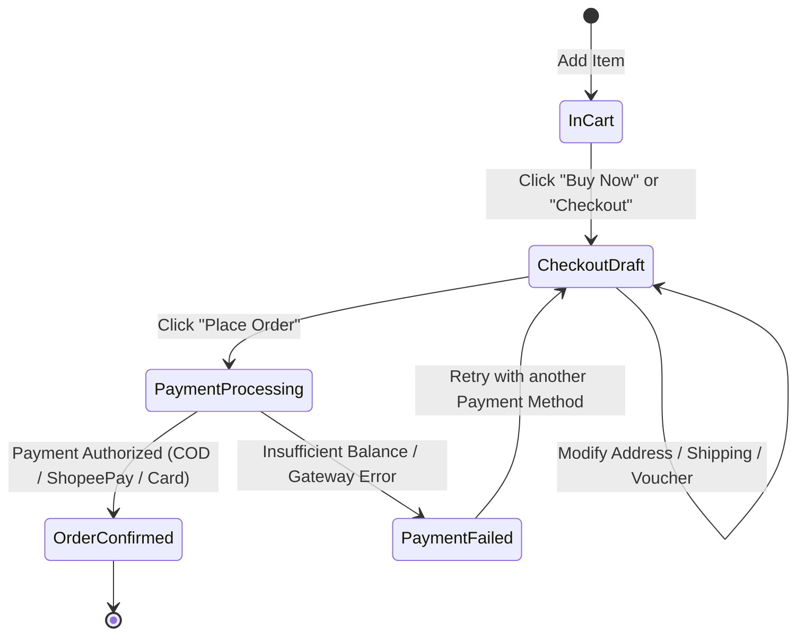

# TEST STRATEGY & TEST DESIGN TECHNIQUES

This document details the software testing techniques and methodologies implemented in the **Shopee Order & Checkout Flow** test suite. Demonstrating these formal Black-Box Test Design techniques showcases strong foundational QA knowledge aligned with the **ISTQB Certified Tester Foundation Level (CTFL)** syllabus.

---

## 1. Equivalence Partitioning (EP)

Equivalence Partitioning divides input domain data into valid and invalid partitions, where all values within a partition are expected to be treated equivalently by the system under test.

### 1.1 Citizen ID / Tax ID Verification (Cross-border & Invoicing)
- **Requirement**: Citizen Identification Number (CCCD) must contain exactly 12 numeric digits.
- **Partitions**:
  - **Valid Partition (P1)**: Exactly 12 numeric digits (e.g., `079198001234`). $\rightarrow$ **Accepted** (Tested in `TC_09`).
  - **Invalid Partition 1 (P2 - Length too short)**: Less than 12 numeric characters (e.g., `123456789`). $\rightarrow$ **Rejected with error** (Tested in `TC_10`, Defect `BUG_001`).
  - **Invalid Partition 2 (P3 - Length too long)**: More than 12 numeric characters (e.g., `0791980012345`). $\rightarrow$ **Field truncates or displays validation error**.
  - **Invalid Partition 3 (P4 - Non-numeric characters)**: Contains alphabetic characters or special symbols (e.g., `07919800A12@`). $\rightarrow$ **Rejected immediately**.

### 1.2 Voucher Code Input
- **Requirement**: Manual promotional code entry.
- **Partitions**:
  - **Valid Partition**: Active, unexpired voucher code meeting user eligibility (Tested in `TC_31`).
  - **Invalid Partition 1**: Expired voucher code (Tested in `TC_33`).
  - **Invalid Partition 2**: Voucher code whose global redemption quota has been exhausted (Tested in `TC_35`).
  - **Invalid Partition 3**: Non-existent or misspelled code (Tested in `TC_34`, Defect `BUG_002`).

---

## 2. Boundary Value Analysis (BVA)

Boundary Value Analysis tests values at the boundaries of equivalence partitions (Min, Min+1, Nominal, Max-1, Max), where developers most frequently introduce off-by-one errors.

### 2.1 Minimum Spend for Voucher Application
- **Requirement**: Shop Voucher gives 15% discount for orders with subtotal $\ge 250,000\text{ VND}$.
- **Boundary Test Points**:
  - `249,999 VND` (Just below boundary): Voucher cannot be selected; informational tooltip shows "Needs 1 VND more to apply" (Tested in `TC_34`).
  - `250,000 VND` (Exact boundary): Voucher selectable and successfully discounts 15% (Tested in `TC_31`).
  - `250,001 VND` (Just above boundary): Voucher selectable and successfully discounts 15%.

### 2.2 Maximum Discount Cap
- **Requirement**: "15% off, capped at a maximum discount of 50,000 VND".
- **Boundary Test Points**:
  - Subtotal `300,000 VND`: $300,000 \times 15\% = 45,000\text{ VND}$ (Discount < Cap $\rightarrow$ applies 45,000 VND).
  - Subtotal `333,333 VND`: $333,333 \times 15\% \approx 50,000\text{ VND}$ (Discount reaches 50,000 VND).
  - Subtotal `500,000 VND`: $500,000 \times 15\% = 75,000\text{ VND}$ (Exceeds Cap $\rightarrow$ strictly limited to 50,000 VND) (Tested in `TC_36`).

### 2.3 Shopee Coins Redemption Limit
- **Requirement**: A maximum of 50% of the total order value can be paid using Shopee Coins (1 Coin = 1 VND).
- **Boundary Test Points**:
  - Total order `100,000 VND`, balance `80,000 Coins`: System caps coin deduction at `50,000 Coins` (Tested in `TC_57`).

---

## 3. Decision Table Testing (Combinatorial Testing)

Decision tables model complex multi-condition business rules where system output depends on a combination of factors.

### 3.1 Voucher Stacking Rules Matrix
Shopee allows combining specific types of vouchers within a single order:

| Rule # | Platform Discount Voucher | Shop Voucher | Free Shipping Voucher | Result / System Action | Covered Test Case |
|:---:|:---:|:---:|:---:|---|:---:|
| **R1** | ✅ Valid | ❌ None | ❌ None | Platform discount applied | `TC_31` |
| **R2** | ❌ None | ✅ Valid | ❌ None | Shop voucher applied | `TC_32` |
| **R3** | ❌ None | ❌ None | ✅ Valid | Shipping fee deducted | `TC_30` |
| **R4** | ✅ Valid | ✅ Valid | ✅ Valid | **All 3 vouchers stacked simultaneously** | `TC_56` |
| **R5** | ✅ 2x Platform Vouchers | ❌ None | ❌ None | **Rejected**: Only 1 platform voucher allowed | `TC_38` |
| **R6** | ❌ None | ✅ 2x Same Shop Vouchers | ❌ None | **Rejected**: Only 1 voucher per shop allowed | `TC_78` |

---

## 4. State Transition Testing

State Transition Testing verifies system behavior during lifecycle changes, ensuring the order entity cannot jump between invalid states.

- **Transitions Verified**:
  - `InCart` $\rightarrow$ `CheckoutDraft`: Verified item attributes, quantities, and prices remain identical (`TC_01`, `TC_02`).
  - `CheckoutDraft` (Field Updates): Real-time asynchronous subtotal recalculation when toggling vouchers or changing shipping channel (`TC_24` to `TC_52`).
  - `CheckoutDraft` $\rightarrow$ `PaymentProcessing`: Disables "Place Order" button immediately upon first click to prevent duplicate charge submissions (`TC_61`).
  - `PaymentProcessing` $\rightarrow$ `PaymentFailed`: Graceful rollback of reserved inventory if payment fails (`TC_63`).

---

## 5. Error Guessing & Exploratory Scenarios

Drawing from tester domain intuition and e-commerce edge-case patterns:
- **Double-click Prevention**: Rapidly double-clicking the "Place Order" button (`TC_61`).
- **Network Interruption**: Disconnecting internet immediately after clicking payment confirmation.
- **Session Timeout**: Leaving the checkout page idle for 30 minutes, then attempting order placement.
- **Concurrent Checkout of Final Stock**: Two accounts attempting to place the last remaining item in stock simultaneously.
- **Device Rotation**: Changing mobile orientation from portrait to landscape on complex forms (Discovered Defect `BUG_003`).
