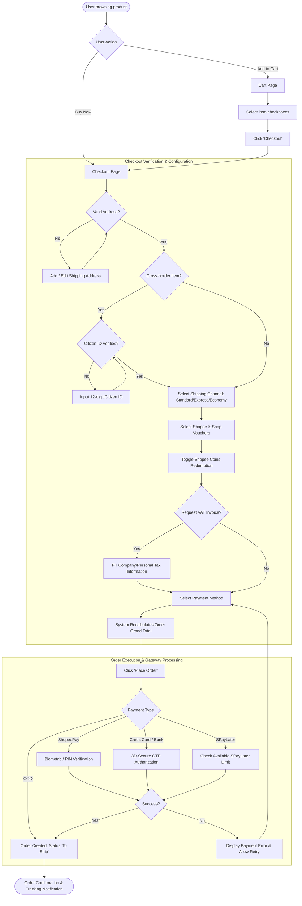
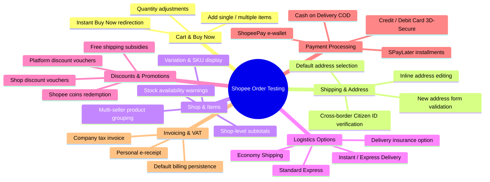

# ORDER FLOWCHART & QA TESTING MINDMAP

Visual diagrams illustrating the Shopee E-Commerce ordering workflow, functional decomposition, and error-handling paths.

---

## 1. End-to-End Order & Checkout Flowchart

---

## 2. Functional Decomposition Mindmap

---

## 3. Voucher Stacking & Price Calculation Logic

```mermaid
flowchart LR
    Subtotal[Item Subtotal] --> PlusShip[+ Shipping Fee]
    PlusShip --> PlusIns[+ Product / Shipping Insurance]
    PlusIns --> MinusShopVoucher[- Shop Voucher Discount]
    MinusShopVoucher --> MinusPlatformVoucher[- Platform Voucher Discount]
    MinusPlatformVoucher --> MinusShipVoucher[- Free Shipping Subsidy]
    MinusShipVoucher --> MinusCoins[- Shopee Coins: max 50% total]
    MinusCoins --> FinalTotal[= Grand Total Amount Due]
```

